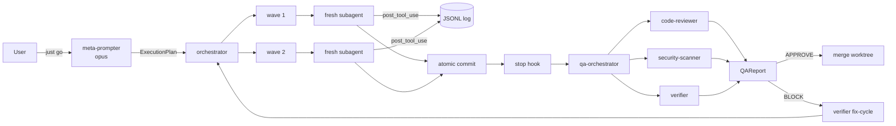

# Soup

_Streck's canonical agentic Claude Code framework for internal app development._

Soup turns natural-language goals into production-ready code through a
spec-driven pipeline of procedural gates, fresh-context subagents, and
automatic QA. It synthesizes patterns from 17 reference repos —
superpowers, spec-kit, LightRAG, Archon, Adiemas, disler's install-
and-maintain and The Library, Karpathy's autoresearch, OpenHarness, and
others — into a single opinionated stack for Python, .NET, React, and
Postgres. See `docs/DESIGN.md` for the full synthesis.

---

## TL;DR

```bash
# Prerequisites: python 3.12, just, docker. Anthropic API key in env.
git clone https://github.com/streck/soup.git  # (adjust to your fork/mirror)
cd soup
just init                                    # venv, deps, postgres, hooks
                                             # also copies .env.example → .env if missing
$EDITOR .env                                 # add ANTHROPIC_API_KEY
just go "build me a health endpoint with a liveness probe"
```

> On Windows, read **Windows setup** below before running `just init` — the
> framework runs recipes via Git Bash and requires a few prerequisites
> that aren't bundled with stock PowerShell/cmd.

That one `just go` invocation:

1. dispatches `meta-prompter` (opus) to decompose the goal into a
   Pydantic-validated `ExecutionPlan`,
2. opens a git worktree under `.soup/worktrees/`,
3. runs waves of fresh subagents (`test-engineer` → `implementer` →
   `verifier`), committing atomically per task,
4. fires the Stop hook, which dispatches `qa-orchestrator` to run
   code-review + security + test subagents in parallel,
5. merges on APPROVE, blocks on findings.

For ad-hoc one-liners: `just quick "<ask>"`.
For a dry-run plan only: `just plan "<goal>"`.
For supervised with per-wave HITL: `just go-i "<goal>"`.

---

## Architecture

```
                     ┌─ just go "<goal>" ──────────────────────────────────┐
                     │                                                    │
                     ▼                                                    │
         ┌───────────────────────┐                                        │
         │   meta-prompter (opus)│  produces ExecutionPlan JSON           │
         └──────────┬────────────┘  (validated by schemas/)               │
                    ▼                                                    │
         ┌───────────────────────┐                                        │
         │    orchestrator       │  runs waves in a worktree              │
         └──────────┬────────────┘                                        │
          ┌─────────┼──────────────┬─────────────┐                        │
          ▼         ▼              ▼             ▼                        │
      spec-writer  test-engineer  implementer   verifier   (fresh subagents
                                                            per TaskStep)
          │         │              │             │                        │
          └────┬────┴──────┬───────┴──────┬──────┘                        │
               ▼           ▼              ▼                               │
            hooks:  pre_tool_use    post_tool_use   (rules + JSONL log)   │
                                                                          │
                    ▼ stop hook ──► qa-orchestrator                       │
                                       ├─ code-reviewer                   │
                                       ├─ security-scanner                │
                                       └─ verifier                        │
                                            │                             │
                                            ▼                             │
                                     QAReport verdict ─────────────► APPROVE/BLOCK
```



---

## Design tenets

Enumerated fully in [`docs/DESIGN.md`](docs/DESIGN.md §1). Headline list:

1. **Spec > code.** Non-trivial work flows through `/specify → /plan → /implement`.
2. **Fresh context per task.** Every substantive unit runs in a clean subagent.
3. **Procedural gates, not suggestions.** TDD, verification, root-cause debugging are iron laws.
4. **Deterministic where possible, agentic where necessary.** Meta-prompter decomposes; orchestrator executes a validated DAG.
5. **Hooks are the nervous system.** Observability, rule injection, QA gating all live in hooks.
6. **Atomic commits per task.** Enables bisect recovery.
7. **Stack-aware, not generic.** Rules/agents routed by file extension.
8. **File-based state.** `.soup/` holds plans, runs, memory as inspectable JSON/markdown.
9. **Reference, don't clone.** `library.yaml` points to canonical skill/agent sources.
10. **Cite everything.** RAG retrievals return source spans; agents attribute claims.

---

## Directory layout

```
soup/
├── .claude/
│   ├── settings.json           hook matchers, permissions
│   ├── agents/                 20-agent roster (orchestrator, implementer, ...)
│   ├── skills/                 12 procedural gates (tdd, systematic-debugging, ...)
│   ├── commands/               /constitution /specify /plan /implement /verify ...
│   └── hooks/                  session_start, pre/post_tool_use, subagent_start, stop
├── .soup/
│   ├── plans/                  ExecutionPlan JSON snapshots
│   ├── runs/<run-id>/          per-run artifacts (trace + qa-report)
│   ├── memory/                 dream-consolidated long-term summaries
│   └── worktrees/<name>/       per-feature git worktrees
├── orchestrator/               DAG executor, meta-prompter, agent factory, CLI
├── rag/                        LightRAG + Postgres + MCP server + ingesters
├── cli_wrappers/               --json wrappers for az devops, psql, docker, dotnet, git
├── schemas/                    Pydantic contracts (ExecutionPlan, QAReport, Spec, ...)
├── rules/{global,python,dotnet,react,typescript,postgres}/
├── templates/{python-fastapi-postgres,dotnet-webapi-postgres,react-ts-vite,fullstack}/
├── logging/                    agent-runs/*.jsonl + experiments.tsv
├── docker/                     Dockerfile.dev + docker-compose.yml + postgres-init.sql
├── docs/                       DESIGN, ARCHITECTURE, PATTERNS, ONBOARDING, references/
├── specs/                      living specs (one per feature)
├── tests/                      framework self-tests
├── CLAUDE.md                   session steering
├── CONSTITUTION.md             iron laws
├── MEMORY.md                   long-term facts
├── library.yaml                skill/agent catalog (The Library pattern)
├── justfile                    three-mode CLI
├── pyproject.toml              python package metadata
└── README.md                   this file
```

---

## Installation

### Prerequisites (all platforms)

| Tool | Version | Purpose |
|---|---|---|
| Python | 3.12+ | Framework runtime |
| Just | 1.25+ | Task runner (`cargo install just` or OS package) |
| Docker | 24+ | Postgres + dev container |
| Git | 2.42+ | Worktrees |
| `uv` (optional) | 0.4+ | Faster dependency install; falls back to pip |
| `gh` (optional) | 2.40+ | GitHub PR flow |
| `az` (optional) | 2.60+ | Azure DevOps work items |

### Windows setup

Soup's `justfile` sets `set shell := ["bash", "-cu"]`. Every recipe
runs under **Git Bash** (bundled with Git for Windows), not PowerShell
or `cmd`. Do the following **before** running `just init`:

1. **Install Git for Windows** (brings Git Bash with it):

   ```powershell
   winget install Git.Git
   ```

2. **Ensure `bash` is on your `PATH`.** Open a fresh terminal and run:

   ```powershell
   bash --version
   ```

   Expected: `GNU bash, version 5.x.x(1)-release (x86_64-pc-msys)`.
   If `bash` is not found, add `C:\Program Files\Git\bin` to the
   System `PATH` and reopen your terminal. Git's installer offers a
   "Use Git and optional Unix tools from the Command Prompt" option
   that does this for you.

3. **Install Windows Terminal** (strongly recommended — provides a
   sane tabs/copy/paste experience, and can default to the Git Bash
   profile):

   ```powershell
   winget install Microsoft.WindowsTerminal
   ```

   In Windows Terminal, set **Git Bash** as the default profile.

4. **Install Just**:

   ```powershell
   winget install Casey.Just
   ```

5. **Install Docker Desktop with the WSL 2 backend.** The
   `docker-compose.yml` in `docker/` assumes Linux containers via
   WSL 2; the Hyper-V backend is not supported.

   ```powershell
   winget install Docker.DockerDesktop
   ```

   After install, open Docker Desktop → Settings → General and
   confirm **"Use the WSL 2 based engine"** is checked. Enable file
   sharing for the drive that hosts this repo (Settings → Resources
   → File Sharing).

6. **Install Python + optional CLIs**:

   ```powershell
   winget install Python.Python.3.12
   # optional:
   winget install GitHub.cli
   winget install Microsoft.AzureCLI
   winget install astral-sh.uv          # strongly recommended; faster than pip
   ```

7. **Clone and initialise** (run these in a Git Bash terminal, not
   PowerShell, so recipe `@` echoes and `/dev/null` redirects work
   the same as on macOS/Linux):

   ```bash
   git clone https://github.com/streck/soup.git   # (adjust to your fork/mirror)
   cd soup
   just init
   ```

Troubleshooting:

- `just: command not found` inside Git Bash → close and reopen the
  terminal after `winget install Casey.Just`; PATH only refreshes on
  new shells.
- `bash: docker: command not found` → Docker Desktop isn't running,
  or its CLI wasn't added to PATH (the installer usually does this,
  but a reboot may be required).
- Recipes that write files fail with permission errors → your repo
  lives under a path Docker Desktop can't mount. Move it out of
  `OneDrive\` and off of any network drive.

### macOS

```bash
brew install python@3.12 just docker git
# optional:
brew install gh azure-cli uv
git clone https://github.com/streck/soup.git && cd soup   # (adjust to your fork/mirror)
just init
```

### Linux (Debian/Ubuntu)

```bash
sudo apt-get install -y python3.12 python3.12-venv git docker.io
curl --proto '=https' -fsSL https://just.systems/install.sh | bash
# optional:
curl -fsSL https://cli.github.com/packages/githubcli-archive-keyring.gpg | \
  sudo dd of=/usr/share/keyrings/githubcli-archive-keyring.gpg
curl -sL https://aka.ms/InstallAzureCLIDeb | sudo bash
git clone https://github.com/streck/soup.git && cd soup   # (adjust to your fork/mirror)
just init
```

### Dev container (reproducible)

```bash
docker compose -f docker/docker-compose.yml up -d
docker compose -f docker/docker-compose.yml exec soup-dev bash
# inside container: just init && just test
```

---

## Stack support

| Stack | Template | Primary agent | Rules | Test runner |
|---|---|---|---|---|
| Python / FastAPI | `python-fastapi-postgres` | `python-dev` | `rules/python/` | pytest |
| Python / Typer CLI | (part of fastapi template) | `python-dev` | `rules/python/` | pytest |
| C# / .NET 8 | `dotnet-webapi-postgres` | `dotnet-dev` | `rules/dotnet/` | xunit |
| React + TypeScript | `react-ts-vite` | `react-dev` | `rules/react/`, `rules/typescript/` | vitest + RTL |
| Postgres 16 | (used by all) | `sql-specialist` | `rules/postgres/` | migration dry-run |
| Full-stack | `fullstack` | orchestrator dispatches | all | combined |

Rules are auto-injected by the `pre_tool_use` hook based on file
extension, so the same `implementer` agent behaves correctly across stacks.

---

## Command reference

Slash commands live in `.claude/commands/` and are invoked from inside a
Claude Code session. The `just` recipes below wrap the common ones.

| Command | `just` recipe | Purpose |
|---|---|---|
| `/constitution` | — | Edit the project's iron laws |
| `/specify <goal>` | (via `just go`) | Write user-facing spec |
| `/clarify` | `just go-i` | HITL ambiguity resolution |
| `/plan` | `just plan "<goal>"` | Write architecture + tech plan |
| `/tasks` | (via `just go`) | Decompose plan into TDD tasks |
| `/implement [task]` | `just go "<goal>"` | Execute waves via orchestrator |
| `/verify` | `just verify` | QA gate on HEAD |
| `/quick <ask>` | `just quick "<ask>"` | Ad-hoc, single-file path |
| `/map-codebase` | — | Pre-planning survey |
| `/review` | — | Cross-agent peer review |
| `/install` | `just install` | Bootstrap hooks |
| `/rag-search <q>` | `just rag "<q>"` | Query org knowledge |
| `/rag-ingest <src>` | `just rag-ingest <src>` | Add source |
| `/soup-init <tmpl>` | `just new <tmpl> <name>` | Scaffold new internal app |

Additional just recipes: `test`, `lint`, `fmt`, `logs`, `experiments`,
`last-qa`, `worktree`, `clean`, `doctor`.

---

## Agent roster

Full YAML + prompts in `.claude/agents/`. Top-level summary (see
`docs/DESIGN.md §6` for the 20-agent table):

- **Orchestration:** `orchestrator`, `meta-prompter`, `architect`, `qa-orchestrator`
- **Authoring:** `spec-writer`, `plan-writer`, `implementer`
- **Stack specialists:** `python-dev`, `dotnet-dev`, `react-dev`, `ts-dev`, `sql-specialist`
- **Quality:** `test-engineer`, `code-reviewer`, `security-scanner`, `verifier`
- **Knowledge:** `rag-researcher`, `docs-ingester`
- **Platform:** `github-agent`, `ado-agent`

Cost discipline (Article VIII): `haiku` for routine research + logs,
`sonnet` for most implementation, `opus` reserved for orchestrator,
meta-prompter, architect, and sql-specialist migrations.

---

## Hook behavior

| Hook | Trigger | Responsibility |
|---|---|---|
| `session_start.py` | new session | load `.env`, prime codebase summary |
| `user_prompt_submit.py` | every user turn | detect intent, nudge to the right skill/command |
| `pre_tool_use.py` | Edit / Write | inject rules by file extension; enforce `files_allowed` glob |
| `post_tool_use.py` | any tool | append structured JSONL log, redact secrets |
| `subagent_start.py` | spawned subagent | inject RAG context + per-stack rules into child prompt |
| `stop.py` | agent halts | dispatch `qa-orchestrator`, write experiments.tsv row |

All events land in `logging/agent-runs/session-{sessionId}.jsonl`; every
tool call is one line. The Stop hook appends a run summary to
`logging/experiments.tsv` — autoresearch-style append-only metrics.

---

## RAG setup

Soup's org knowledge layer runs LightRAG against Postgres with an MCP
wrapper so any Claude client can query it.

```bash
just init                                           # starts postgres
just rag-ingest github:streck/docs                  # clone + ingest
just rag-ingest ado:streck/internal/wiki            # ADO wiki adapter
just rag-ingest fs:/path/to/local/docs              # local files
just rag-ingest https://docs.streck.example/api    # web source
just rag "how do we authenticate the payroll API?"
just rag-mcp                                         # expose as MCP server
```

Every retrieval returns `[source:path#span]` citations — uncited claims
are a constitutional violation (Article VII.3).

Architecture deep-dive: `docs/ARCHITECTURE.md`.

---

## Contributing

1. Read `CONSTITUTION.md`. Iron laws are non-negotiable.
2. Read `CLAUDE.md` for steering context.
3. Use `just go "<goal>"` for anything non-trivial — the framework
   eats its own dog food.
4. New agents/skills/commands: follow the playbooks in `docs/PATTERNS.md`.
5. Framework self-tests: `just test`. Lint + type-check: `just lint`.
6. Commits follow Conventional Commits (`feat(scope): ...`). Atomic per
   task; the orchestrator enforces this in its worktrees.
7. PRs must pass the Stop-hook QA gate (APPROVE verdict) to merge.

Review loop for framework changes: build → mock-app exercises
framework → 3-reviewer panel critiques → patch → repeat (cap 5 cycles
Python path, 3 cycles C# path).

---

## License

Apache-2.0 (placeholder; confirm with Streck legal before external release).

Copyright © Streck AI Engineering.
